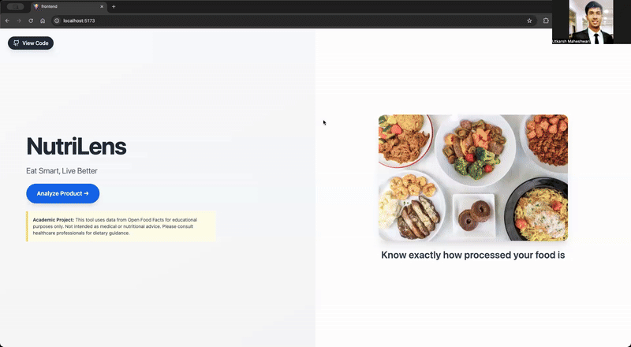
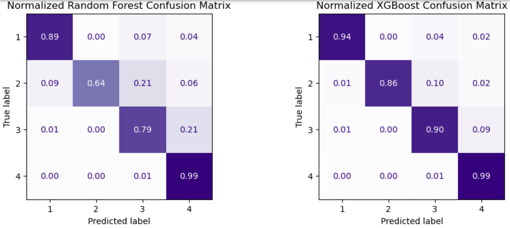
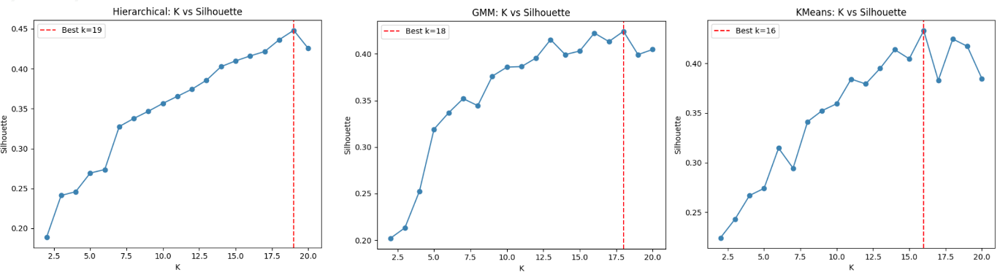
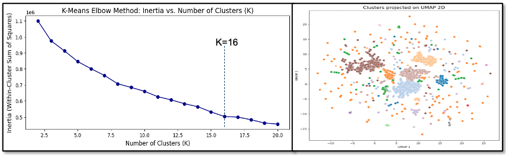
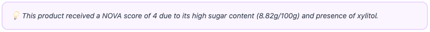

# NutriLens - Intelligent Food Recommendation System
NutriLens predicts NOVA scores and recommends healthier alternatives using ML & LLM explanations.

Food product labels, mandated to display nutritional content, ingredients, and allergens, are often inaccessible to the average consumer due to a lack of domain knowledge required to interpret them. Nutrilens uses machine learning to:
- Classify processing level in the products (by NOVA score: 1-4 scale)
- Recommend less-processed alternatives with similar taste profiles
- Provide AI-generated explanations for processing scores

<div align="center">
  
</div>

**[Try it now! (nutri-lens-nu.vercel.app)](https://nutri-lens-nu.vercel.app/)**

## Data

- **Data source**: [Open Food Facts](https://world.openfoodfacts.org/) (~3.7M products)
- **Challenges**: Significant class imbalannce as 90% of all the food categories comprised less than 10% of the data and highly processed products dominated the dataset (87%)
- **Data preprocessing**: Sentence transformer embeddings using all-MiniLM-L6-v2, UMAP to reduce dimensions etc.


## Models

### Supervised Learning: NOVA Score Classification

**Algorithms Tested**: Random Forest, XGBoost  
**Features**:
- Ingredient embeddings (all-MiniLM-L6-v2)
- Nutritional metrics (sugars, fiber, additives, etc.)

**Output**: Level of procesing in the product indicated by NOVA score (1 being unprocessed, 4 ultra processed)

**Performance Summary**

| Model | Accuracy | Macro F1 | Macro Precision | Macro Recall | Weighted F1 | Weighted Precision | Weighted Recall |
|-------|----------|----------|-----------------|--------------|-------------|-------------------|-----------------|
| Random Forest | 0.95 | 0.88 | 0.94 | 0.83 | 0.95 | 0.95 | 0.95 |
| **XGBoost**  | **0.97** | **0.94** | **0.96** | **0.92** | **0.97** | **0.97** | **0.97** |

**Selected Model**: **XGBoost** (Macro F1: 0.97)

**Analysis**: Important features include a PCA-reduced TF-IDF embedding of the product name, a SentenceBERT embedding representation of the product ingredient list, and the amount of carbohydrates per 100g of the product

<div align="center">
  
</div>


### Unsupervised Learning: Product Clustering

**Algorithms Tested**: K-Means, GMM, Hierarchical  
**Features**: Ingredient embeddings (all-MiniLM-L6-v2) reduced to 150 dimensions using UMAP

**Output**: 3 alternate products with lower processing score from the same cluster to ensure similar taste (ingredients) and category

**Performance Summary**

<div align="center">
  
</div>

**Selected Model**: **K-Means (k=16)** (Silhouette: 0.4)

**Analysis**: K-Means consistently produced the most stable and interpretable partitions, as its spherical cluster assumption aligns reasonably well with the geometry of the 150- dimensional UMAP embedding. The moderate scores across all models are expected, reflecting the blended nature of ingredients in the embedding space

<div align="center">
  
</div>


### Smart Explnations

Meta's Llama 3.2 (3B) generates explanations grounded in actual product data—citing specific ingredients, additive counts, and nutritional values—to avoid black-box predictions and reduce hallucination.

<div align="center">
  
</div>


## Installation & Setup

### Prerequisites
- Python 3.10+
- Node.js 18+
- [Ollama](https://ollama.ai/) for local LLM explanations

### Backend Setup
```bash
# 1. Clone repository
git clone https://github.com/utkarsh-mhw/nutrilens.git
cd nutrilens

# 2. Install Python dependencies
pip install -r requirements.txt

# 3. Install Ollama and download model
brew install ollama
ollama pull llama3.2:3b

# 4. Start Ollama server (keep running in separate terminal)
ollama serve

# 5. Run Flask backend (from project root)
python -m backend.app
```

Backend runs on `http://localhost:5002`

---

### Frontend Setup
```bash
# 1. Navigate to frontend
cd frontend

# 2. Install dependencies
npm install

# 3. Start development server
npm run dev
```

Frontend runs on `http://localhost:5173`


## Project Structure
```
nutrilens/
├── backend/
│   ├── app.py # Flask API
│   └── src/
│       └── analyze_product.py # ML pipeline
├── frontend/ # React UI
├── models/ # Trained models (.pkl files)
├── data/analysis_data # Processed datasets
└── notebooks/ # Jupyter notebooks (EDA, training, testing)
```


## Features

- Real-time NOVA score prediction
- Cluster-based recommendations (same taste profile, lower processing)
- AI-generated explanations (via local Llama 3.2)
- Visual nutrition comparison (macros, additives, fiber)
- 20 pre-loaded demo products


## Disclaimer

**This is an academic project for educational purposes only.**

- Not intended for medical or nutritional advice
- Predictions are based on Open Food Facts data (user-contributed)
- Consult healthcare professionals for dietary recommendations
- NOVA scores are approximations and may not reflect latest product formulations


## Contact/ Questions

For any questions, feedback, or collaboration opportunities, feel free to reach out:

- Email: [utkarshm005@gmail.com](mailto:utkarshm005@gmail.com) / [umaheshwari8@gatech.edu](mailto:umaheshwari8@gatech.edu)
- LinkedIn: [linkedin.com/in/utkarshmah](https://www.linkedin.com/in/utkarshmah)

Star this repo if you found it useful!